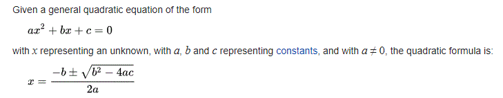

# CPSC 118 - Homework #2

I used `uv`.

---

> **Homework #2**
>
> Create a python script called `homework2_yourName.py`
> Include your name in a python comment at the top of the program.
>
> 1. Start with this python list of foods:
>
>    ```python
>    favorite_foods = ["pizza", "tacos", "apples", "pasta", "ice cream"]
>    ```
>
>    Prompt the user for their favorite food. Append the user's favorite food to the list. Change the 2nd item in the list from tacos to steak.
>
> 2. Include this python list in your program:
>
>    ```python
>    hackingAttemptsPerDay = [2, 7, 14, 8, 3, 6, 4]
>    ```
>
>    Use the python commands we learned in class to print the smallest number of attacks, largest number of attacks, and a sum of all the attacks. If the values in the list are changed, the program should still work.
>
> 3. Ask a user how many hours they plan to study, how many hours they plan to sleep, and how many hours they plan to eat, and print out the number of hours left for play.
> 4. Use python and the quadratic formula:

<!-- >     -->

> Find the 2 roots for this equation: `2x² – 8x – 24 = 0`
>
> When you run the program, the output should look like:
>
> ```text
> **************** Problem 1 ****************
> What is your favorite food? Muffins
> ['pizza', 'steak', 'apples', 'pasta', 'ice cream', 'Muffins']
> **************** Problem 2 ****************
> There were 2 hacking attempts on the best day
> There were 14 hacking attempts on the worst day
> There were 44 hacking attempts overall
> **************** Problem 3 ****************
> How many hours do you plan to study? : 4
> How many hours do you plan to sleep? : 8
> How many hours do you plan to eat? : 2
> You have 10 hours left to play
> **************** Problem 4 ****************
> The roots are: 6.0 and -2.0
> ```
